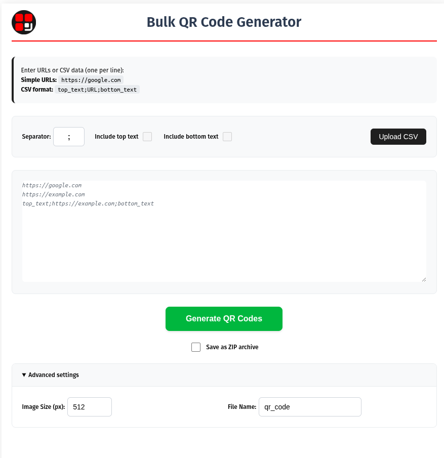

# Bulk QR Code Generator (Chrome Extension)

A powerful Chrome extension for bulk-generating QR codes from URLs or CSV data. The extension operates in a dedicated browser tab, offering a rich user interface for managing input, settings, and generation.

  

## Features

- **Bulk Generation**: Create hundreds or thousands of QR codes at once from a simple list.
- **Dedicated Tab UI**: A clean, full-page interface, not a small popup.
- **Flexible Data Input**:
    - Paste a list of URLs (one per line).
    - Use CSV data (`top_text;URL;bottom_text`) to add captions above and below the QR code.
    - Upload a `.csv` or `.txt` file to populate the input field.
- **Customizable Output**:
    - Configure the CSV separator character (default is `;`).
    - Add optional top and bottom text to the final QR code images.
    - Set a custom image size (in pixels).
    - Define a custom base filename for your batch.
- **Smart File Naming**: Files are saved in a timestamped sub-directory (e.g., `Downloads/001_bulk_qr_codes/20251024_1030_my-batch/`) with automatically padded sequence numbers (e.g., `..._001.png`, `..._002.png`).
- **Error Handling**: The tool processes all valid lines and skips invalid ones. A detailed `errors.txt` file is generated for any lines that could not be processed.
- **Save as ZIP**: Optionally, save all generated images and the error log into a single, convenient ZIP archive.

## How to Use

1.  **Click the Extension Icon**: This will open the Bulk QR Code Generator in a new browser tab.
2.  **Provide Your Data**:
    - Paste your data (URLs or CSV) into the large textarea.
    - Alternatively, click "Upload CSV" to load data from a file.
3.  **Configure Settings** (Optional):
    - Adjust the CSV separator or enable/disable text captions.
    - Expand "Advanced settings" to change the image size or output filename.
    - Check "Save as ZIP archive" to get a single download.
4.  **Click Generate**: The process will start. The UI will be disabled during generation.
5.  **Done**: Your files will be saved to your browser's `Downloads` folder. A status message will confirm the number of successful files and any errors.

## Development

The extension is built with plain HTML, CSS, and JavaScript, using `esbuild` to bundle dependencies.

1.  **Install Dependencies**:
    ```bash
    npm install
    ```
2.  **Build for Development**:
    ```bash
    npm run build
    ```
3.  **Load the Extension**:
    - Open Chrome and navigate to `chrome://extensions`.
    - Enable "Developer mode".
    - Click "Load unpacked" and select the project's root directory.

## License

This project is licensed under the Apache License 2.0. See the [LICENSE](LICENSE) file for details.
